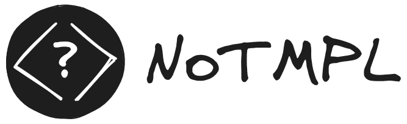

<p align="center">
    
</p>

# NoTMPL
A light-weight template-less rendering engine for PHP back-end devs.
 - ☑ No dependencies
 - ☑ Lightweight code base (< 1000 LOC)
 - ☑ No cache directory
 - ☑ No eval
 - ☑ Composition of pages using components and slots
 - ☑ Free from autoescaping
 - ☑ Free from sandboxing

## Installation
Install the library using composer:
```
composer require stefgodin/notmpl
```

### Requirements
This library requires PHP 8.1+

## Quick peek

```php
<?php // index.php

use StefGodin\NoTmpl\NoTmpl;

require_once __DIR__.'/../vendor/autoload.php'

$noTmpl = new NoTmpl();
echo $noTmpl->render('main.php', ['title' => 'My custom title']);
/*
<div>A header</div>

<h1>My custom title</h1>
<div>
  <div>
    <h2>My content</h2>
  </div>
</div>

<div>A footer</div>
*/
```

```php
<?php // main.php

namespace StefGodin\NoTmpl;

/**
 * @var string $title
 */
?>
<?php component('page.php') ?>
    <?php use_slot('header') ?>
        <h1><?php e($title) ?></h1>
    <?php use_slot_end() ?>
    
    <div>
        <h2>My content</h2>
    </div>
<?php component_end() ?>

<div>A footer</div>
```

```php
<?php // page.php
namespace StefGodin\NoTmpl;
?>
<div>A header</div>

<?php slot('header') ?>
    <h1>My normal title</h1>
<?php slot_end() ?>
<div>
    <?php slot() ?>
        <div>Some default content</div>
    <?php slot_end() ?>
</div>
```

## Documentation
Read the [getting started guide](doc/getting_started.md) if you are new.\
Browse the [documentation](doc/index.md) for examples and concepts.

## Support
 - [Issues](https://github.com/stefgodin/notmpl/issues)